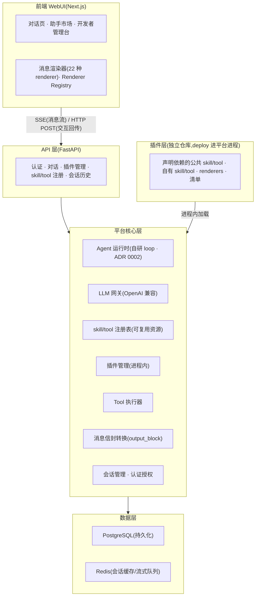

# agentplatform 总体技术设计

- 文档版本:v0.2(草案)
- 日期:2026-08-11
- 流程阶段:阶段 2 · 设计
- 对应需求:[001-product-requirements.md](../requirements/001-product-requirements.md) v1.1
- 对应愿景:[../vision.md](../vision.md)

---

## 1. 系统架构概览

### 1.1 架构分层

> 图表规范:文档图优先使用 [Mermaid](https://mermaid.js.org/)(GitHub 可渲染),替代 ASCII 图。



### 1.2 关键设计原则
- **skill/tool 为平台级可复用资源**(第一特色):独立于插件,通过注册表共享,插件声明依赖并显式调用
- **平台与插件解耦**:平台定义插件规范契约,插件独立仓库开发,部署后进程内加载
- **运行时可演进**:插件加载与 skill/tool 调用抽象为接口,进程内 -> 隔离可演进且不破坏上层 API
- **LLM 协议统一**:所有模型走 OpenAI 兼容协议;skill/tool 调用复用协议的 function-calling 机制

## 2. 模块划分

### 2.1 后端(`agentplatform/`)
| 模块 | 职责 |
|------|------|
| `agentplatform/api` | FastAPI 路由、请求/响应模型、SSE 流式接口 |
| `agentplatform/core/agent` | agent 调度循环、上下文组装、**显式调用编排**(把 skill/tool 作为可调用单元交给 LLM) |
| `agentplatform/core/llm` | LLM 网关:OpenAI 兼容客户端、端点配置、流式转发 |
| `agentplatform/core/registry` | **skill/tool 注册表**:资源池、元信息、版本、来源、依赖解析 |
| `agentplatform/core/plugin` | 插件管理器:加载、清单校验、生命周期 |
| `agentplatform/core/tool` | tool 执行器:调用编程接口、危险操作限制 |
| `agentplatform/core/skill` | skill 执行器:加载 skill 行为、参数化执行(可能为子 agent) |
| `agentplatform/core/session` | 会话与上下文管理、历史持久化 |
| `agentplatform/core/auth` | 账号密码认证、JWT、角色授权 |
| `agentplatform/core/message` | 消息信封(ContentBlock)转换层、流式分块、嵌套校验、降级 |
| `agentplatform/sdk` | 插件开发 SDK(供独立仓库引用) |
| `agentplatform/cli` | 部署 CLI(init/validate/dev/deploy/logs) |

### 2.2 前端(`web/`)
| 模块 | 职责 |
|------|------|
| `web/app` | Next.js App Router 页面:对话、市场、管理台、登录 |
| `web/components/chat` | 通用对话 UI、消息流、SSE 流式渲染 |
| `web/components/renderers` | 21 种内置 renderer 组件 + 插件自定义 renderer 注入点 |
| `web/lib/registry` | Renderer Registry、命名空间校验、降级组件 |
| `web/lib/api` | API 客户端、SSE 处理、交互回传 |

### 2.3 插件仓库结构(示例,独立仓库)
```
my-assistant/
├── plugin.yaml          # 清单:元信息、依赖的公共 skill/tool、自有 skill/tool、UI 组件、模型
├── skills/              # 自有 skill 定义
├── tools/               # 自有 tool 实现(Python)
├── ui/                  # (可选)自定义前端组件
└── pyproject.toml       # 依赖(引用 agentplatform.sdk)
```

## 3. 关键技术决策(已对齐 vision)

| 决策 | 选择 | 状态 |
|------|------|------|
| skill/tool 模型 | 模型 C:function-calling 扩展,声明依赖 + agent 显式调用 | ✅ |
| agent 运行时 | **自研核心 loop,借鉴成熟模式,不引入重量级框架** | ✅(ADR 0002) |
| 消息信封 | `Message = {role, blocks[]}`,ContentBlock 是渲染单元 | ✅(详见 003 v2.0) |
| 富交互组件 | 21 种 renderer + 插件声明 + 块级挂件(ADR 0001 命名空间) | ✅ |
| 多模型路由 | MVP 助手指定单一模型 | ✅ |
| 数据库 | PostgreSQL + Redis | ✅ |
| 部署 | docker-compose 单机起步 | ✅ |
| 认证 | 账号密码 + JWT | ✅ |

## 4. 核心数据流

### 4.1 对话流(体现显式调用)
```
用户发消息
  -> API(认证) -> agent 运行时
  -> 组装上下文(skill 系统提示 + 历史)
  -> 从注册表加载插件声明的依赖 skill/tool,映射为 LLM tools 参数
  -> LLM 网关(流式,OpenAI 兼容)
  -> 流式返回文本(前端逐字渲染)
  -> 若 LLM 返回 tool_calls:
       - tool 调用 -> tool 执行器 -> 结果回填
       - skill 调用 -> skill 执行器(参数化执行/子 agent)-> 结果回填
     -> 再推理
  -> 若 LLM 输出 block 元信息(`output_block` tool_call) -> 后端拦截转 SSE `block_meta` -> 前端按 renderer registry 渲染
  -> 用户与交互控件交互 -> POST /blocks/{bid}/interact -> 插件 handler -> 续 block 列表
```

### 4.2 插件部署流
```
开发者独立仓库(引用 agentplatform.sdk)
  -> CLI: agentplatform deploy ./my-assistant --target <platform>
  -> CLI 打包插件 -> 传输到平台 -> 插件管理器加载(进程内)
  -> 校验清单、解析依赖的公共 skill/tool -> 注册表登记自有 skill/tool
  -> 助手出现在市场
```

## 5. 技术栈细化

| 层 | 选型 |
|----|------|
| 后端语言 | Python 3.11+ |
| Web 框架 | FastAPI + Uvicorn |
| 数据校验 | Pydantic v2 |
| ORM / 迁移 | SQLAlchemy 2.0 + Alembic |
| 认证 | JWT(passlib[bcrypt] + python-jose) |
| 前端 | Next.js 14(App Router)+ React 18 + TypeScript |
| 样式 | Tailwind CSS |
| 数据库 | PostgreSQL 15+ |
| 缓存 | Redis 7+ |
| 插件 SDK | 基于 agentplatform/core 抽象的 Python 包,独立发布 |

## 6. 后续子设计文档
- `002-skill-tool-model.md` -- skill/tool 模型:注册表、依赖声明、显式调用协议、组合性、来源权限【第一特色核心】
- `003-ui-components.md` -- 消息渲染设计(v2.0):消息信封、21 种 renderer、容器嵌套、降级、交互回传、安全(对应需求 003)
- `004-data-model.md` -- 数据模型与 ER 设计
- `005-api-design.md` -- API 接口设计
- `006-plugin-spec.md` -- 插件规范:清单、SDK、CLI 协议
